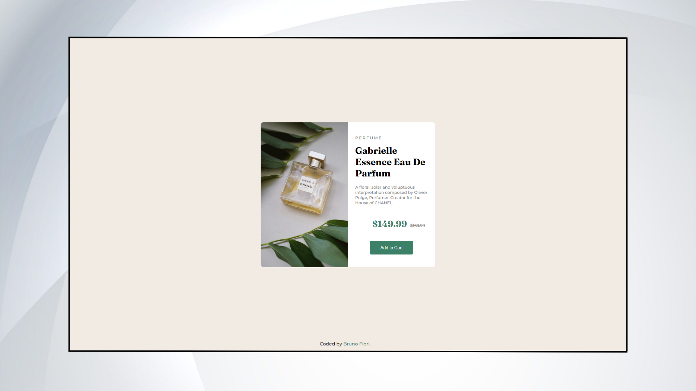
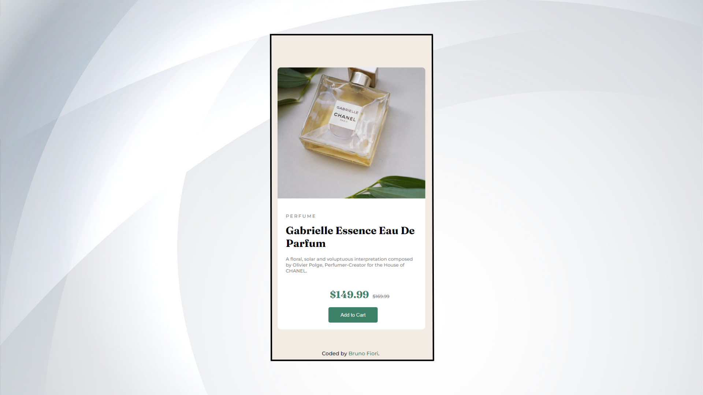

# Frontend Mentor - Product preview card component solution

This is a solution to the [Product preview card component challenge on Frontend Mentor](https://www.frontendmentor.io/challenges/product-preview-card-component-GO7UmttRfa) by Bruno Fiori.

## Table of contents

- [Overview](#overview)
    - [The challenge](#the-challenge)
    - [Screenshot](#screenshot)
    - [Built with](#built-with)
    - [What I learned](#what-i-learned)
    - [Continued development](#continued-development)
    - [Author](#author)
    - [Acknowledgments](#acknowledgments)

## Overview

### The challenge

Users should be able to:

- View the optimal layout depending on their device's screen size
- See hover and focus states for interactive elements

### Screenshot

### Built with

- Semantic HTML5 markup
- CSS custom properties
- Google font - Family: [Montserrat],[Fraunces]
- CSS Grid

### What I learned

My biggest challenge was definitely learning about responsiveness, where I had to adapt the page to versions with other screen resolutions

I learned a very important and useful css function for this, here is an example:

'''css

@media (max-width: 600px){
    CHANGES HERE
}

Through this function, devices with resolution width less than 600px will be affected and your code will be changed from it.

Briefly, after making your entire desktop page in css, you can change certain characteristics for mobile adaptation from this function.

### Continued development

Future upgrades of this page would be its vertical expansion, some lines of code prevented me from doing it so easily.

## Author

- Frontend Mentor - Bruno S Fiori (https://www.frontendmentor.io/profile/BrunoSFiori)
- Github - Bruno S Fiori (https://github.com/BrunoSFiori)

## Acknowledgments

A layman learning front-end. Thanks for reading and following my html and css projects =D
